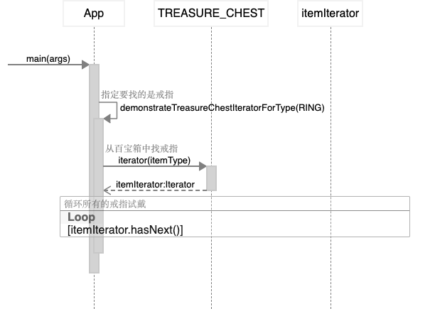

# 迭代器 Iterator

## 又被称为
游标

## 目的
提供一种在不暴露其基础表示的情况下顺序访问聚合对象的元素的方法。

## 解释

真实世界例子

> 百宝箱包含一组魔法物品。有多种物品，例如戒指，药水和武器。可以使用藏宝箱提供的迭代器按类型浏览商品。

通俗地说

> 容器可以提供与表示形式无关的迭代器接口，以提供对元素的访问。

维基百科说

> 在面向对象的编程中，迭代器模式是一种设计模式，其中迭代器用于遍历容器并访问容器的元素。

**程序示例**

在我们的示例中包含物品的藏宝箱是主要类。

```java
// 百宝箱
public class TreasureChest {

    // 物品集合
  private final List<Item> items;

  // 初始化一个百宝箱,放入各式各样的物品
  public TreasureChest() {
    items = List.of(
        new Item(ItemType.POTION, "Potion of courage"),
        new Item(ItemType.RING, "Ring of shadows"),
        new Item(ItemType.POTION, "Potion of wisdom"),
        new Item(ItemType.POTION, "Potion of blood"),
        new Item(ItemType.WEAPON, "Sword of silver +1"),
        new Item(ItemType.POTION, "Potion of rust"),
        new Item(ItemType.POTION, "Potion of healing"),
        new Item(ItemType.RING, "Ring of armor"),
        new Item(ItemType.WEAPON, "Steel halberd"),
        new Item(ItemType.WEAPON, "Dagger of poison"));
  }

  public Iterator<Item> iterator(ItemType itemType) {
    return new TreasureChestItemIterator(this, itemType);
  }

  public List<Item> getItems() {
    return new ArrayList<>(items);
  }
}

// 物品
public class Item {

    // 物品类型
  private ItemType type;
    // 物品名称
  private final String name;

  public Item(ItemType type, String name) {
    this.setType(type);
    this.name = name;
  }

  @Override
  public String toString() {
    return name;
  }

  public ItemType getType() {
    return type;
  }

  public final void setType(ItemType type) {
    this.type = type;
  }
}

// 物品类型枚举
public enum ItemType {

  ANY, WEAPON, RING, POTION

}
```

迭代器接口极度简单。

```java
// 迭代器接口
public interface Iterator<T> {

  boolean hasNext();

  T next();
}
```

在以下示例中，我们遍历在宝箱中找到的戒指类型物品。

```java
var itemIterator = TREASURE_CHEST.iterator(ItemType.RING);
while (itemIterator.hasNext()) {
  LOGGER.info(itemIterator.next().toString());
}
// Ring of shadows
// Ring of armor
```

## 类图


## 时序图



## 实现方式

* 声明迭代器接口。 该接口必须提供**至少一个方法来获取集合中的下个元素**。 但为了使用方便， 你还可以添加一些其他方法， 例如获取前一个元素、 记录当前位置和判断迭代是否已结束。
* 声明集合接口并描述一个获取迭代器的方法。 其返回值必须是迭代器接口。 如果你计划拥有多组不同的迭代器， 则可以声明多个类似的方法。
* 为希望使用迭代器进行遍历的集合实现具体迭代器类。 迭代器对象必须与单个集合实体链接。 **链接关系通常通过迭代器的构造函数建立**。
* 在你的集合类中实现集合接口。 其主要思想是针对特定集合为客户端代码提供创建迭代器的快捷方式。 集合对象必须将自身传递给迭代器的构造函数来创建两者之间的链接。
* 检查客户端代码， 使用迭代器替代所有集合遍历代码。 **每当客户端需要遍历集合元素时都会获取一个新的迭代器**。

## 适用场景

* 当集合背后为复杂的数据结构， 且你希望对客户端隐藏其复杂性时 （出于使用便利性或安全性的考虑）， 可以使用迭代器模式。
* 使用该模式可以减少程序中重复的遍历代码。
* 如果你希望代码能够遍历不同的甚至是无法预知的数据结构， 可以使用迭代器模式。

**优点**

* 单一职责原则。 通过将体积庞大的遍历算法代码抽取为独立的类， 你可对客户端代码和集合进行整理。
* 开闭原则。 你可实现新型的集合和迭代器并将其传递给现有代码， 无需修改现有代码。
* 你可以并行遍历同一集合， 因为每个迭代器对象都包含其自身的遍历状态。
* 相似的， 你可以暂停遍历并在需要时继续。

**缺点**

* 如果你的程序只与简单的集合进行交互， 应用该模式可能会矫枉过正。
* 对于某些特殊集合， 使用迭代器可能比直接遍历的效率低。

## 与其他模式的关系

* 你可以使用[迭代器模式](Iterator)来遍历[组合模式](Composite)树。
* 你可以同时使用[工厂方法模式](Factory)和[迭代器](Iterator)来让子类集合返回不同类型的迭代器， 并使得迭代器与集合相匹配。
* 你可以同时使用[备忘录模式](Memento)和[迭代器](Iterator)来获取当前迭代器的状态， 并且在需要的时候进行回滚。
* 可以同时使用[访问者模式](Visitor)和迭Iterator遍历复杂数据结构， 并对其中的元素执行所需操作， 即使这些元素所属的类完全不同。

## Java世界例子

* [java.util.Iterator](http://docs.oracle.com/javase/8/docs/api/java/util/Iterator.html)
* [java.util.Enumeration](http://docs.oracle.com/javase/8/docs/api/java/util/Enumeration.html)

## 鸣谢

* [Design Patterns: Elements of Reusable Object-Oriented Software](https://www.amazon.com/gp/product/0201633612/ref=as_li_tl?ie=UTF8&camp=1789&creative=9325&creativeASIN=0201633612&linkCode=as2&tag=javadesignpat-20&linkId=675d49790ce11db99d90bde47f1aeb59)
* [Head First Design Patterns: A Brain-Friendly Guide](https://www.amazon.com/gp/product/0596007124/ref=as_li_tl?ie=UTF8&camp=1789&creative=9325&creativeASIN=0596007124&linkCode=as2&tag=javadesignpat-20&linkId=6b8b6eea86021af6c8e3cd3fc382cb5b)
