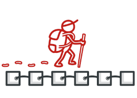

# 简介 Introduction
**设计模式**是软件设计中常见问题的典型解决方案。 每个模式就像一张蓝图， 你可以通过对其进行定制来解决代码中的特定设计问题。

## 优势
模式是针对软件设计中常见问题的解决方案工具箱， 它们定义了一种让你的团队能更高效沟通的通用语言。

## 学习模式之前必须懂的一些基础概念

* 类、字段（成员变量）、方法
* 可见性：`+ public`、`- private`、`# protected` `~ default` 。。。
* 修饰关键字： `abstract`、`static`、`final`。。。
* 接口（interface）、实现（Implement）。。。

## 看懂UML类图和时序图

* 车的类图结构为 `<<abstract>>` ，表示车是一个**抽象类**；
* 它有两个继承类：小汽车和自行车；它们之间的关系为**实现关系**，使用**带空心箭头的虚线**表示；
* **小汽车为与SUV**之间也是**继承关系**，它们之间的关系为**泛化关系**，使用**带空心箭头的实线**表示；
* **小汽车与发动机**之间是**组合关系**，使用**带实心箭头的实线**表示（个体与组成部分之间的关联关系）；
* **学生与班级**之间是**聚合关系**，使用**带空心箭头的实线**表示（集体与个体之间的关联关系）；
* **学生与身份证**之间为**关联关系**，使用**一根实线**表示（无法用聚合和组合表示的关系）；
* 学生上学需要用到自行车，与自行车是一种**依赖关系**，使用**带箭头的虚线**表示；

---
# 创建型模式
> 这类模式提供创建对象的机制， 能够提升已有代码的灵活性和可复用性。

###  [工厂方法 Factory Method](Factory.md)
> 在父类中提供一个创建对象的接口以允许子类决定实例化对象的类型

###  [抽象工厂 Abstract Factory](Abstract.md)
> 让你能创建一系列相关的对象， 而无需指定其具体类。

###  [建造者 Builder](Builder.md)
> 使你能够分步骤创建复杂对象。 该模式允许你使用相同的创建代码生成不同类型和形式的对象。

###  [原型 Prototype](Prototype.md)
> 让你能够复制已有对象， 而又无需使代码依赖它们所属的类。

###  [单例 Singleton](Singleton.md)
> 让你能够保证一个类只有一个实例， 并提供一个访问该实例的全局节点。

---
# 结构型模式
> 这类模式介绍如何将对象和类组装成较大的结构， 并同时保持结构的灵活和高效。

###  [适配器 Adapter](Adapter.md)
> 让接口不兼容的对象能够相互合作。

###  [桥接 Bridge](Bridge.md)
> 可将一个大类或一系列紧密相关的类拆分为抽象和实现两个独立的层次结构， 从而能在开发时分别使用。

###  [组合 Composite](Composite.md)
> 你可以使用它将对象组合成树状结构， 并且能像使用独立对象一样使用它们。

###  [装饰 Decorator](Decorator.md)
> 允许你通过将对象放入包含行为的特殊封装对象中来为原对象绑定新的行为。

###  [外观 Facade](Facade.md)
> 能为程序库、 框架或其他复杂类提供一个简单的接口。

###  [享元 Flyweight](Flyweight.md)
> 摒弃了在每个对象中保存所有数据的方式， 通过共享多个对象所共有的相同状态， 让你能在有限的内存容量中载入更多对象。

###  [代理 Proxy](Proxy.md)
> 让你能够提供对象的替代品或其占位符。 代理控制着对于原对象的访问， 并允许在将请求提交给对象前后进行一些处理。

---
# 行为模式
> 这类模式负责对象间的高效沟通和职责委派。

###  [责任链 Chain of Responsibility](Chain.md)
> 允许你将请求沿着处理者链进行发送。 收到请求后， 每个处理者均可对请求进行处理， 或将其传递给链上的下个处理者。

###  [命令 Command](Command.md)
> 它可将请求转换为一个包含与请求相关的所有信息的独立对象。 该转换让你能根据不同的请求将方法参数化、 延迟请求执行或将其放入队列中， 且能实现可撤销操作。

###  [迭代器 Iterator](Iterator.md)
> 让你能在不暴露集合底层表现形式 （列表、 栈和树等） 的情况下遍历集合中所有的元素。

###  [中介者 Mediator](Mediator.md)
> 能让你减少对象之间混乱无序的依赖关系。 该模式会限制对象之间的直接交互， 迫使它们通过一个中介者对象进行合作。

###  [备忘录 Memento](Memento.md)
> 允许在不暴露对象实现细节的情况下保存和恢复对象之前的状态。

###  [观察者 Observer](Observer.md)
> 允许你定义一种订阅机制， 可在对象事件发生时通知多个 “观察” 该对象的其他对象。

###  [状态 State](State.md)
> 让你能在一个对象的内部状态变化时改变其行为， 使其看上去就像改变了自身所属的类一样。

###  [策略 Strategy](Strategy.md)
> 能让你定义一系列算法， 并将每种算法分别放入独立的类中， 以使算法的对象能够相互替换。

###  [模板方法 Template Method](Template.md)
> 在超类中定义一个算法的框架， 允许子类在不修改结构的情况下重写算法的特定步骤。

###  [访问者 Visitor](Visitor.md)
> 将算法与其所作用的对象隔离开来。
