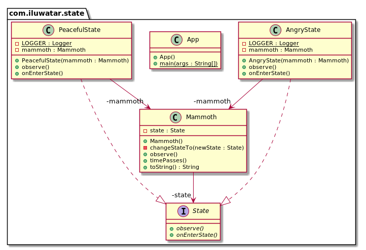
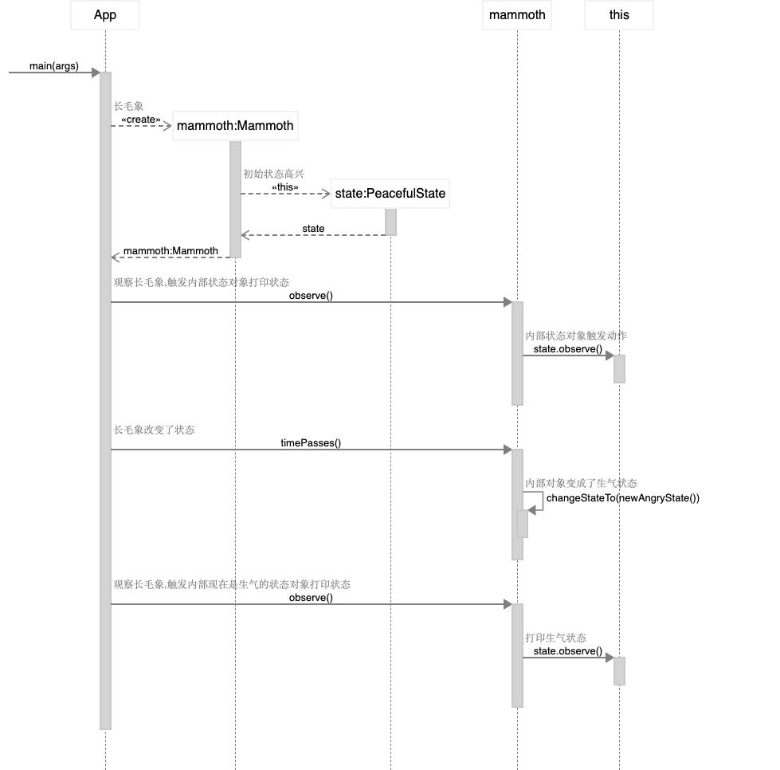

# 状态 State

## 又被称为
对象状态

## 目的
允许对象在内部状态改变时改变它的行为。对象看起来好像修改了它的类。

## 解释
真实世界例子

> 当在长毛象的自然栖息地观察长毛象时，似乎它会根据情况来改变自己的行为。它开始可能很平静但是随着时间推移当它检测到威胁时它会对周围的环境感到愤怒和危险。

通俗的说

> 状态模式允许对象改变它的行为。

维基百科说

> 状态模式是一种允许对象在内部状态改变时改变它的行为的行为型设计模式。这种模式接近于有限状态机的概念。状态模式可以被理解为策略模式，它能够通过调用在模式接口中定义的方法来切换策略。

**编程示例**

这里是模式接口和它具体的实现。

```java
// 状态基类
public interface State {

    // 进入状态
  void onEnterState();

  // 观察
  void observe();
}

// 平静状态
public class PeacefulState implements State {

  private final Mammoth mammoth;

  // 构造一个长毛象到当前状态
  public PeacefulState(Mammoth mammoth) {
    this.mammoth = mammoth;
  }

  // 观察它是平静的
  @Override
  public void observe() {
    LOGGER.info("{} 观察它是平静的.", mammoth);
  }

  // 进入平静状态,长毛象冷静下来
  @Override
  public void onEnterState() {
    LOGGER.info("{} 冷静下来.", mammoth);
  }
}

// 愤怒状态
public class AngryState implements State {

  private static final Logger LOGGER = LoggerFactory.getLogger(AngryState.class);

  private final Mammoth mammoth;

  // 构造一个长毛象到当前状态
  public AngryState(Mammoth mammoth) {
    this.mammoth = mammoth;
  }

  // 观察它是狂怒的
  @Override
  public void observe() {
    LOGGER.info("{} 很生气!", mammoth);
  }

  // 长毛象开始生气了...
  @Override
  public void onEnterState() {
    LOGGER.info("{} 生气了!", mammoth);
  }
}
```

然后这里是包含状态的长毛象。

```java
// 长毛象 具有定义其行为的内部状态。
public class Mammoth {

  private State state;

  // 默认是平静状态
  public Mammoth() {
    state = new PeacefulState(this);
  }

  // 状态切换
  public void timePasses() {
    if (state.getClass().equals(PeacefulState.class)) {
      changeStateTo(new AngryState(this));
    } else {
      changeStateTo(new PeacefulState(this));
    }
  }

  private void changeStateTo(State newState) {
    this.state = newState;
    this.state.onEnterState();
  }

  @Override
  public String toString() {
    return "The mammoth";
  }

  public void observe() {
    this.state.observe();
  }
}
```

然后这里是长毛象随着时间的推移后的整个行为示例。你会发现长毛象一会儿平静一会儿狂怒

```java
    var mammoth = new Mammoth();
    mammoth.observe();
    mammoth.timePasses();
    mammoth.observe();
    mammoth.timePasses();
    mammoth.observe();
```

控制台输出:

```shell
长毛象 是平静的.
长毛象 生气了!
长毛象 很生气!
长毛象 冷静下来.
长毛象 是平静的.
```

## 类图



## 时序图



## 实现方式

* 确定哪些类是上下文。 它可能是包含依赖于状态的代码的已有类； 如果特定于状态的代码分散在多个类中， 那么它可能是一个新的类。
* 声明状态接口。 虽然你可能会需要完全复制上下文中声明的所有方法， 但最好是仅把关注点放在那些可能包含特定于状态的行为的方法上。
* 为每个实际状态创建一个继承于状态接口的类。 然后检查上下文中的方法并将与特定状态相关的所有代码抽取到新建的类中。
  * 在将代码移动到状态类的过程中， 你可能会发现它依赖于上下文中的一些私有成员。 你可以采用以下几种变通方式：
    * 将这些成员变量或方法设为公有。
    * 将需要抽取的上下文行为更改为上下文中的公有方法， 然后在状态类中调用。 这种方式简陋却便捷， 你可以稍后再对其进行修补。
    * 将状态类嵌套在上下文类中。 这种方式需要你所使用的编程语言支持嵌套类。
* 在上下文类中添加一个状态接口类型的引用成员变量， 以及一个用于修改该成员变量值的公有设置器。
* 再次检查上下文中的方法， 将空的条件语句替换为相应的状态对象方法。
* 为切换上下文状态， 你需要创建某个状态类实例并将其传递给上下文。 你可以在上下文、 各种状态或客户端中完成这项工作。 无论在何处完成这项工作， 该类都将依赖于其所实例化的具体类。

## 适用场景

* 如果对象需要根据自身当前状态进行不同行为， 同时状态的数量非常多且与状态相关的代码会频繁变更的话， 可使用状态模式。
  * 模式建议你将所有特定于状态的代码抽取到一组独立的类中。 这样一来， 你可以在独立于其他状态的情况下添加新状态或修改已有状态， 从而减少维护成本。
* 如果某个类需要根据成员变量的当前值改变自身行为， 从而需要使用大量的条件语句时， 可使用该模式。
  * 状态模式会将这些条件语句的分支抽取到相应状态类的方法中。 同时， 你还可以清除主要类中与特定状态相关的临时成员变量和帮手方法代码。
* 当相似状态和基于条件的状态机转换中存在许多重复代码时， 可使用状态模式。
  * 状态模式让你能够生成状态类层次结构， 通过将公用代码抽取到抽象基类中来减少重复。

**优点**

* 单一职责原则。 将与特定状态相关的代码放在单独的类中。
* 开闭原则。 无需修改已有状态类和上下文就能引入新状态。
* 通过消除臃肿的状态机条件语句简化上下文代码。

**缺点**

* 如果状态机只有很少的几个状态， 或者很少发生改变， 那么应用该模式可能会显得小题大作。

## 与其他模式的关系

* [桥接模式](Bridge)、 [状态模式](State)和[策略模式](Strategy) （在某种程度上包括[适配器模式](Adapter)） 模式的接口非常相似。 实际上， 它们都**基于组合模式——即将工作委派给其他对象**， 不过也各自解决了不同的问题。 模式并不只是以特定方式组织代码的配方， 你还可以使用它们来和其他开发者讨论模式所解决的问题。
* [状态](State)可被视为[策略](Strategy)的扩展。 两者都基于组合机制： 它们都通过将部分工作委派给 “帮手” 对象来改变其在不同情景下的行为。 策略使得这些对象相互之间完全独立， 它们不知道其他对象的存在。 但状态模式没有限制具体状态之间的依赖， 且允许它们自行改变在不同情景下的状态。

## Java中例子

* [javax.faces.lifecycle.Lifecycle#execute()](http://docs.oracle.com/javaee/7/api/javax/faces/lifecycle/Lifecycle.html#execute-javax.faces.context.FacesContext-) controlled by [FacesServlet](http://docs.oracle.com/javaee/7/api/javax/faces/webapp/FacesServlet.html), the behavior is dependent on current phase of lifecycle.
* [JDiameter - Diameter State Machine](https://github.com/npathai/jdiameter/blob/master/core/jdiameter/api/src/main/java/org/jdiameter/api/app/State.java)

## 鸣谢

* [Design Patterns: Elements of Reusable Object-Oriented Software](https://www.amazon.com/gp/product/0201633612/ref=as_li_tl?ie=UTF8&camp=1789&creative=9325&creativeASIN=0201633612&linkCode=as2&tag=javadesignpat-20&linkId=675d49790ce11db99d90bde47f1aeb59)
* [Head First Design Patterns: A Brain-Friendly Guide](https://www.amazon.com/gp/product/0596007124/ref=as_li_tl?ie=UTF8&camp=1789&creative=9325&creativeASIN=0596007124&linkCode=as2&tag=javadesignpat-20&linkId=6b8b6eea86021af6c8e3cd3fc382cb5b)
* [Refactoring to Patterns](https://www.amazon.com/gp/product/0321213351/ref=as_li_tl?ie=UTF8&camp=1789&creative=9325&creativeASIN=0321213351&linkCode=as2&tag=javadesignpat-20&linkId=2a76fcb387234bc71b1c61150b3cc3a7)
