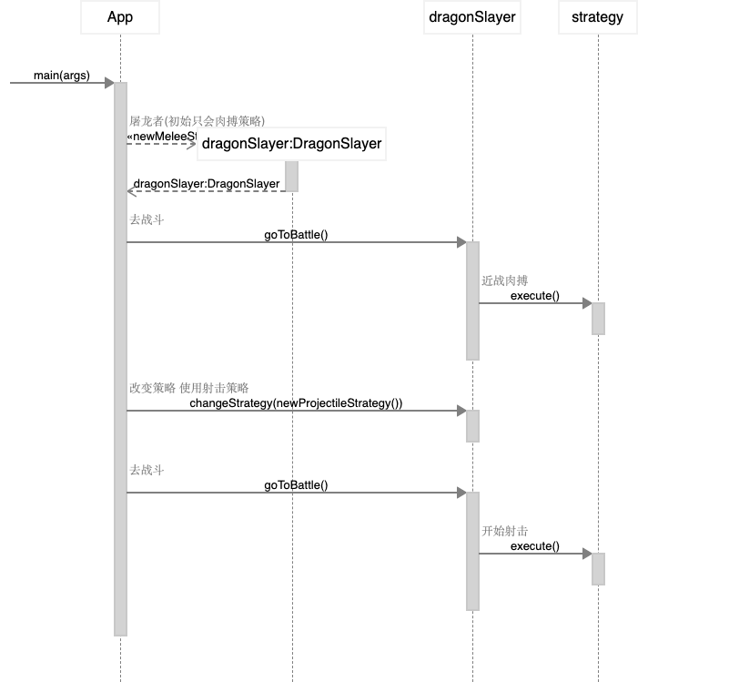

# 策略 Strategy

## 又被称为
政策（方针）模式

## 目的

定义一个家族算法，并封装好其中每一个，使它们可以互相替换。策略模式使算法的变化独立于使用它的客户。

## 解释

现实世界例子

> 屠龙是一项危险的职业。有经验将会使它变得简单。经验丰富的屠龙者对不同类型的龙有不同的战斗策略。       

直白点说

> 策略模式允许在运行时选择最匹配的算法。

维基百科上说

> 在程序编程领域，策略模式（又叫政策模式）是一种启用在运行时选择算法的行为型软件设计模式。

**编程实例**

让我们先介绍屠龙的策略模式接口和它的实现。

```java
/**
 * 策略接口
 */
@FunctionalInterface
public interface DragonSlayingStrategy {

  void execute();

}

/**
 * 近战策略
 */
@Slf4j
public class MeleeStrategy implements DragonSlayingStrategy {

  @Override
  public void execute() {
    LOGGER.info("用你的神剑斩断龙头！");
  }
}

/**
 * 射击策略
 */
@Slf4j
public class ProjectileStrategy implements DragonSlayingStrategy {

  @Override
  public void execute() {
    LOGGER.info("你用魔法弩射龙，它倒在地上死了！");
  }
}

/**
 * 咒语策略
 */
@Slf4j
public class SpellStrategy implements DragonSlayingStrategy {

  @Override
  public void execute() {
    LOGGER.info("你施展了瓦解咒语，巨龙在一堆尘土中蒸发！");
  }

}
```

现在有一个强力的屠龙者要基于上面的组件来选择他的战斗策略。

```java
/**
 * 屠龙者使用不同的策略来杀死龙。
 */
public class DragonSlayer {

  private DragonSlayingStrategy strategy;

  public DragonSlayer(DragonSlayingStrategy strategy) {
    this.strategy = strategy;
  }

  public void changeStrategy(DragonSlayingStrategy strategy) {
    this.strategy = strategy;
  }

  public void goToBattle() {
    strategy.execute();
  }
}
```

最后是屠龙者的行动。

```java
    // GoF Strategy pattern
    LOGGER.info("前方发现绿龙");
    DragonSlayer dragonSlayer = new DragonSlayer(new MeleeStrategy());
    dragonSlayer.goToBattle();
    LOGGER.info("红龙现身");
    dragonSlayer.changeStrategy(new ProjectileStrategy());
    dragonSlayer.goToBattle();
    LOGGER.info("黑龙在你面前降落");
    dragonSlayer.changeStrategy(new SpellStrategy());
    dragonSlayer.goToBattle();
```

控制台输出:

```shell
前方发现绿龙
用你的神剑斩断龙头！
红龙现身
你用魔法弩射龙，它倒在地上死了！
黑龙在你面前降落
你施展了瓦解咒语，巨龙在一堆尘土中蒸发！
```

## 类图


## 时序图



## 实现方式

* 从上下文类中找出修改频率较高的算法 （也可能是用于在运行时选择某个算法变体的复杂条件运算符）。
* 声明该算法所有变体的通用策略接口。
* 将算法逐一抽取到各自的类中， 它们都必须实现策略接口。
* 在上下文类中**添加一个成员变量用于保存对于策略对象的引用**。 然后**提供设置器以修改该成员变量**。 **上下文仅可通过策略接口同策略对象进行交互**， 如有需要还可定义一个接口来让策略访问其数据。
* 客户端必须将上下文类与相应策略进行关联， 使上下文可以预期的方式完成其主要工作。

## 适用场景

* 当你想使用对象中各种不同的算法变体， 并希望能在运行时切换算法时， 可使用策略模式。
  * 策略模式让你能够将对象关联至可以不同方式执行特定子任务的不同子对象， 从而以间接方式在运行时更改对象行为。
* 当你有许多仅在执行某些行为时略有不同的相似类时， 可使用策略模式。
  * 策略模式让你能将不同行为抽取到一个独立类层次结构中， 并将原始类组合成同一个， 从而减少重复代码。
* 如果算法在上下文的逻辑中不是特别重要， 使用该模式能将类的业务逻辑与其算法实现细节隔离开来。
  * 策略模式让你能将各种算法的代码、 内部数据和依赖关系与其他代码隔离开来。 不同客户端可通过一个简单接口执行算法， 并能在运行时进行切换。
* 当类中使用了复杂条件运算符以在同一算法的不同变体中切换时， 可使用该模式。
  * 策略模式将所有继承自同样接口的算法抽取到独立类中， 因此不再需要条件语句。 原始对象并不实现所有算法的变体， 而是将执行工作委派给其中的一个独立算法对象。

**优点**

* 你可以在运行时切换对象内的算法。
* 你可以将算法的实现和使用算法的代码隔离开来。
* 你可以使用组合来代替继承。
* 开闭原则。 你无需对上下文进行修改就能够引入新的策略。

**缺点**

* 如果你的算法极少发生改变， 那么没有任何理由引入新的类和接口。 使用该模式只会让程序过于复杂。
* 客户端必须知晓策略间的不同——它需要选择合适的策略。
* 许多现代编程语言支持函数类型功能， 允许你在一组匿名函数中实现不同版本的算法。 这样， 你使用这些函数的方式就和使用策略对象时完全相同， 无需借助额外的类和接口来保持代码简洁。

## 与其他模式的关系

* [桥接模式](Bridge)、 [状态模式](State)和[策略模式](Strategy) （在某种程度上包括[适配器模式](Adapter)） 模式的接口非常相似。 实际上， 它们都基于组合模式——即将工作委派给其他对象， 不过也各自解决了不同的问题。 模式并不只是以特定方式组织代码的配方， 你还可以使用它们来和其他开发者讨论模式所解决的问题。
* [命令模式](Command)和[策略](Strategy)看上去很像， 因为两者都能通过某些行为来参数化对象。 但是， 它们的意图有非常大的不同。
  * 你可以使用[命令](Command)来将任何操作转换为对象。 操作的参数将成为对象的成员变量。 你可以通过转换来延迟操作的执行、 将操作放入队列、 保存历史命令或者向远程服务发送命令等。
  * 另一方面， [策略](Strategy)通常可用于描述完成某件事的不同方式， 让你能够在同一个上下文类中切换算法。
* [装饰模式](Decorator)可让你更改对象的外表， [策略](Strategy)则让你能够改变其本质。
* [模板方法模式](Template)基于**继承机制**： 它允许你通过扩展子类中的部分内容来改变部分算法。 策略基于**组合机制**： 你可以通过对相应行为提供不同的策略来改变对象的部分行为。 模板方法在类层次上运作， 因此它是静态的。 策略在对象层次上运作， 因此允许在运行时切换行为。
* [状态](State)可被视为策略的扩展。 两者都基于**组合机制**： 它们都通过将部分工作委派给 “帮手” 对象来改变其在不同情景下的行为。 [策略](Strategy)使得这些对象相互之间完全独立， 它们不知道其他对象的存在。 但[状态模式](State)没有限制具体状态之间的依赖， 且允许它们自行改变在不同情景下的状态。

## 例子:

* org.springframework.beans.factory.support.InstantiationStrategy InstantiationStrategy 负责使用 Bean 类的默认构造函数、带参构造函数或者工厂方法等来实例化 Bean，是一个策略模式的接口
  * 顶层的策略抽象非常简单，它下面有 SimpleInstantiationStrategy 和 CglibSubclassingInstantiationStrategy 两种策略

## 教学

* [Strategy Pattern Tutorial](https://www.journaldev.com/1754/strategy-design-pattern-in-java-example-tutorial)

## 鸣谢

* [Design Patterns: Elements of Reusable Object-Oriented Software](https://www.amazon.com/gp/product/0201633612/ref=as_li_tl?ie=UTF8&camp=1789&creative=9325&creativeASIN=0201633612&linkCode=as2&tag=javadesignpat-20&linkId=675d49790ce11db99d90bde47f1aeb59)
* [Functional Programming in Java: Harnessing the Power of Java 8 Lambda Expressions](https://www.amazon.com/gp/product/1937785467/ref=as_li_tl?ie=UTF8&camp=1789&creative=9325&creativeASIN=1937785467&linkCode=as2&tag=javadesignpat-20&linkId=7e4e2fb7a141631491534255252fd08b)
* [Head First Design Patterns: A Brain-Friendly Guide](https://www.amazon.com/gp/product/0596007124/ref=as_li_tl?ie=UTF8&camp=1789&creative=9325&creativeASIN=0596007124&linkCode=as2&tag=javadesignpat-20&linkId=6b8b6eea86021af6c8e3cd3fc382cb5b)
* [Refactoring to Patterns](https://www.amazon.com/gp/product/0321213351/ref=as_li_tl?ie=UTF8&camp=1789&creative=9325&creativeASIN=0321213351&linkCode=as2&tag=javadesignpat-20&linkId=2a76fcb387234bc71b1c61150b3cc3a7)
