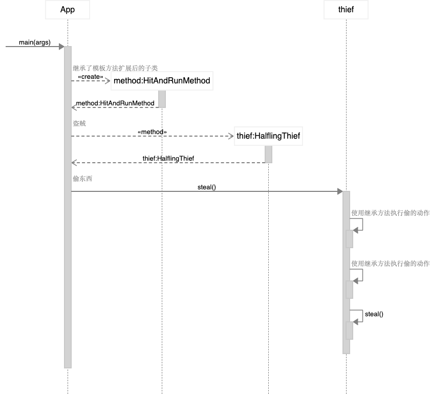

# 模板方法 Template Method

## 目的
在一个操作中定义算法的骨架，将某些步骤推迟到子类。模板方法允许子类重新定义算法的某些步骤，而无需更改算法的结构。

## 解释
真实世界例子

> 偷东西的一般步骤是相同的。 首先，选择目标，然后以某种方式使其迷惑，最后，你偷走了该物品。然而这些步骤有很多实现方式。

通俗的说

> 模板方法模式在父类中列出一般的步骤然后让具体的子类定义实现细节。

维基百科说

> 在面向对象的编程中，模板方法是Gamma等人确定的行为设计模式之一。在《设计模式》一书中。模板方法是父类中一个方法，通常是一个抽象父类，根据许多高级步骤定义了操作的骨架。这些步骤本身由与模板方法在同一类中的其他帮助程序方法实现。

**编程示例**

让我们首先介绍模板方法类及其具体实现。

```java
/**
 * 偷窃方法抽象类
 */
@Slf4j
public abstract class StealingMethod {

  // 选择目标
  protected abstract String pickTarget();

  // 迷惑目标
  protected abstract void confuseTarget(String target);

  // 偷
  protected abstract void stealTheItem(String target);

  /**
   * 偷东西
   */
  public void steal() {
    String target = pickTarget();
    LOGGER.info("目标锁定 {}", target);
    confuseTarget(target);
    stealTheItem(target);
  }
}

/**
 * 贴身偷窃手法
 */
@Slf4j
public class SubtleMethod extends StealingMethod {

  @Override
  protected String pickTarget() {
    return "店主";
  }

  @Override
  protected void confuseTarget(String target) {
    LOGGER.info("流着眼泪走近 {} 并拥抱他！", target);
  }

  @Override
  protected void stealTheItem(String target) {
    LOGGER.info("在密切接触时偷走 {} 的钱包。", target);
  }
}

/**
 * 运动中直接偷的手法
 */
@Slf4j
public class HitAndRunMethod extends StealingMethod {

  @Override
  protected String pickTarget() {
    return "老女人";
  }

  @Override
  protected void confuseTarget(String target) {
    LOGGER.info("从后面接近 {}。", target);
  }

  @Override
  protected void stealTheItem(String target) {
    LOGGER.info("拿起手提包，快速逃跑！");
  }
}
```

这是包含模板方法的半身贼类。

```java
/**
 * 贼
 */
public class HalflingThief {

  // 偷窃方法
  private StealingMethod method;

  public HalflingThief(StealingMethod method) {
    this.method = method;
  }

  // 偷窃
  public void steal() {
    method.steal();
  }

  // 改变手法
  public void changeMethod(StealingMethod method) {
    this.method = method;
  }
}
```
最后，我们展示半身人贼如何利用不同的偷窃方法。

```java
    HalflingThief thief = new HalflingThief(new HitAndRunMethod());
    thief.steal();
    thief.changeMethod(new SubtleMethod());
    thief.steal();
```

控制台输出:

```shell
目标锁定 老女人
从后面接近 老女人。
拿起手提包，快速逃跑！

目标锁定 店主
流着眼泪走近 店主 并拥抱他！
在密切接触时偷走 店主 的钱包。
```

## 类图


## 时序图



## 实现方式

* 分析目标算法， 确定能否将其分解为**多个步骤**。 从所有子类的角度出发， 考虑哪些步骤能够通用， 哪些步骤各不相同。
* 创建抽象基类并声明一个模板方法和代表算法步骤的一系列抽象方法。 在模板方法中根据算法结构依次调用相应步骤。 可用 final最终修饰模板方法以防止子类对其进行重写。
* 虽然可将所有步骤全都设为抽象类型， 但默认实现可能会给部分步骤带来好处， 因为子类无需实现那些方法。
* **可考虑在算法的关键步骤之间添加钩子**。
* 为每个算法变体新建一个具体子类， 它必须实现所有的抽象步骤， 也可以重写部分可选步骤。

## 适用场景

* 当你只希望客户端扩展某个特定算法步骤， 而不是整个算法或其结构时， 可使用模板方法模式。
  * 模板方法将整个算法转换为一系列独立的步骤， 以便子类能对其进行扩展， 同时还可让超类中所定义的结构保持完整。
* 当多个类的算法除一些细微不同之外几乎完全一样时， 你可使用该模式。 但其后果就是， 只要算法发生变化， 你就可能需要修改所有的类。
  * 在将算法转换为模板方法时， 你可将相似的实现步骤提取到超类中以去除重复代码。 子类间各不同的代码可继续保留在子类中。

**优点**

* 你可仅允许客户端重写一个大型算法中的特定部分， 使得算法其他部分修改对其所造成的影响减小。
* 你可将重复代码提取到一个超类中。

**缺点**

* 部分客户端可能会受到算法框架的限制。
* 通过子类抑制默认步骤实现可能会导致违反_里氏替换原则_。
* 模板方法中的步骤越多， 其维护工作就可能会越困难。

## 与其他模式的关系

* [工厂方法模式](Factory)是[模板方法模式](Template)的一种特殊形式。 同时， 工厂方法可以作为一个大型模板方法中的一个步骤。
* [模板方法](Template)**基于继承机制**： 它允许你通过扩展子类中的部分内容来改变部分算法。 [策略模式](Strategy)**基于组合机制**： 你可以通过对相应行为提供不同的策略来改变对象的部分行为。 模板方法在类层次上运作， 因此它是静态的。 策略在对象层次上运作， 因此允许在运行时切换行为。

## 教程

* [Template-method Pattern Tutorial](https://www.journaldev.com/1763/template-method-design-pattern-in-java)

## Java例子

* org.springframework.context.support.AbstractApplicationContext#refresh()
* [javax.servlet.GenericServlet.init](https://jakarta.ee/specifications/servlet/4.0/apidocs/javax/servlet/GenericServlet.html#init--): 
Method `GenericServlet.init(ServletConfig config)` calls the parameterless method `GenericServlet.init()` which is intended to be overridden in subclasses.
Method `GenericServlet.init(ServletConfig config)` is the template method in this example.

## 鸣谢

* [Design Patterns: Elements of Reusable Object-Oriented Software](https://www.amazon.com/gp/product/0201633612/ref=as_li_tl?ie=UTF8&camp=1789&creative=9325&creativeASIN=0201633612&linkCode=as2&tag=javadesignpat-20&linkId=675d49790ce11db99d90bde47f1aeb59)
* [Head First Design Patterns: A Brain-Friendly Guide](https://www.amazon.com/gp/product/0596007124/ref=as_li_tl?ie=UTF8&camp=1789&creative=9325&creativeASIN=0596007124&linkCode=as2&tag=javadesignpat-20&linkId=6b8b6eea86021af6c8e3cd3fc382cb5b)
* [Refactoring to Patterns](https://www.amazon.com/gp/product/0321213351/ref=as_li_tl?ie=UTF8&camp=1789&creative=9325&creativeASIN=0321213351&linkCode=as2&tag=javadesignpat-20&linkId=2a76fcb387234bc71b1c61150b3cc3a7)
